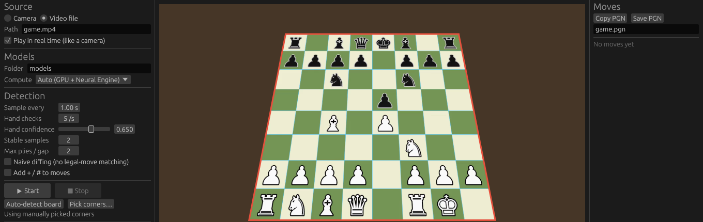

# chess-video-moves (Rust port)

[](https://github.com/eujc21/chess-video-move-detection/actions/workflows/rust.yml)

A Rust port of the Python pipeline in this repository, using the same three YOLO models. It has two programs:

- **`chess-video-moves`** (command line) reads video files and writes the moves in algebraic notation to a CSV file (`row_id,output`).
- **`chess-video-gui`** (desktop app) analyses a live webcam or a video file, with Start/Stop, a preview showing the detected board and pieces, and the move list as PGN.



## Requirements

- **Rust** 1.88 or newer.
- **ffmpeg and ffprobe** on `PATH`. They decode video and capture from cameras.
- **ONNX exports of the models, and ONNX Runtime.** The repository ships the models as PyTorch `.pt` files, which only PyTorch can load. Run this once (it needs Python 3):

  ```bash
  rust/scripts/export-models.sh   # writes src/models/*-model.onnx
  ```

  The script installs its tools into `.venv` at the repository root, including ONNX Runtime. The programs find ONNX Runtime there on their own.

  ONNX Runtime must be version 1.17 or newer. The programs also look in the Homebrew and `/usr/local` locations and on the library path. To use a specific copy, set `ORT_DYLIB_PATH` to the library file.
- **Working directory.** The model paths default to `src/models/...`. They work from the repository root, from `rust/`, or wherever the binary is, as long as it is inside the repository.

## Usage

From the repository root:

```bash
rust/scripts/export-models.sh      # once
cargo build --release --manifest-path rust/Cargo.toml
rust/target/release/chess-video-moves src/inputs/*.mp4 -o result.csv
```

Useful options (`--help` lists them all):

| Option | Default | Meaning |
| --- | --- | --- |
| `--interval` | `1` | Seconds between analysed frames. |
| `--hand-checks-per-second` | `5` | How often the hand model runs. Set it to the video's fps to match the Python behaviour, which checks every frame. |
| `--hand-confidence` | `0.65` | Minimum confidence for a hand detection. |
| `--stable-samples` | `2` | How many consecutive samples must agree before a position is used. |
| `--max-plies` | `2` | Most moves inferred between two accepted positions, for moves hidden while a hand was over the board. |
| `--max-residual` | `1.5` | Largest board mismatch allowed after a matched move. |
| `--board-corners "x,y x,y x,y x,y"` | none | Fixed board corners (TL TR BR BL). Use it for a fixed camera or when the board model fails. |
| `--check-marks` | off | Append `+` / `#` to moves. |
| `--naive` | off | Use the original frame-diff move detection instead of legal-move matching. |
| `--threads` | `0` | ONNX Runtime intra-op threads. `0` means the runtime default. |
| `--compute-units` | `all` | Apple Silicon only: `all` (GPU + Neural Engine), `gpu` (Metal), `ane` (Neural Engine) or `cpu`. |

On Linux or Windows with an NVIDIA GPU, build with `--features cuda` or `--features tensorrt`. This needs a matching ONNX Runtime build.

## Desktop app (webcam)

```bash
cargo build --release --features gui --manifest-path rust/Cargo.toml
rust/target/release/chess-video-gui            # from the repository root
```

1. Pick a camera (or a video file), resolution and frame rate, then press **Start**.
2. The first run loads the models, which takes a few seconds.
3. The preview shows the board outline (red while a hand is over the board), the square grid, and the pieces the model sees (upper-case letters on light discs are white, on dark discs black).
4. Moves appear on the right. **Copy PGN** and **Save PGN** export the game, with a FEN header if it didn't start from the initial position.
5. If the board model finds the wrong area, press **Pick corners…** and click the board's four corners on the preview. **Auto-detect board** switches back to the model, for example after moving the camera.

Frames the analysis can't keep up with are dropped, so it stays in step with the camera instead of lagging. Command-line flags:

- `--device`, `--file`, `--models <folder>` and `--board-corners` pre-fill the settings; `--start` begins capturing right away.
- `--renderer auto|glow|wgpu` picks the graphics backend. `auto` uses wgpu (Metal) on macOS and glow (OpenGL) elsewhere. Try the other one if the window fails to open.
- `--smoke-test` opens the window, renders a few frames and exits. With `--start --file <video>` it also waits until the models have analysed a few frames, and fails if loading the models or the runtime fails.

Cameras are opened through ffmpeg: AVFoundation on macOS (device `0`, `1`, … or its name), V4L2 on Linux (`/dev/video0`), DirectShow on Windows (the device name).

## Apple Silicon (Metal)

On macOS the build automatically includes ONNX Runtime's CoreML execution provider, so the models run on the GPU (through Metal) and the Neural Engine instead of the CPU:

- **CoreML settings.** Models are compiled in the ML Program format, which runs in FP16 on the GPU / Neural Engine, with static input shapes and the "fast prediction" specialisation.
- **Compiled-model cache.** Compiled models are cached in `~/Library/Caches/chess-video-moves`, so only the first start is slow. Each model also does one warm-up run at load time.
- **Compute units.** Use `--compute-units` (or the *Compute* menu in the app) to compare GPU only, Neural Engine only, or both. `all` is usually fastest; if a model runs slower than expected, try `gpu`.
- **Hardware video decoding.** Video files are decoded with VideoToolbox (`-hwaccel videotoolbox`).
- **App rendering.** The desktop app draws through wgpu, which uses Metal on macOS.

Setup:

```bash
brew install ffmpeg
rust/scripts/export-models.sh   # models + ONNX Runtime (with CoreML) in .venv
cargo build --release --features gui --manifest-path rust/Cargo.toml
rust/target/release/chess-video-gui
```

macOS asks for camera permission the first time. Grant it to your terminal, or to the app you launch the program from.

Once CoreML is in use, you can afford to raise `--hand-checks-per-second` (up to the camera fps) for Python-equivalent hand gating.

## FreeBSD

CI runs the tests, the CLI with the real models and the desktop app in a FreeBSD virtual machine on every change. Nobody has tried it on FreeBSD hardware with a real webcam yet. Inference runs on the CPU, because ONNX Runtime has no GPU backend for FreeBSD.

```sh
pkg install rust ffmpeg onnxruntime webcamd
pkg install libXcursor libXrandr libXi libxkbcommon   # X11 libraries the desktop app loads at startup
sysrc webcamd_enable=YES && service webcamd start   # USB webcams appear as /dev/video0, ...
pw groupmod webcamd -m $USER                        # allow your user to open the camera
cargo build --release --features gui --manifest-path rust/Cargo.toml
```

- **Camera support:** cameras are opened through ffmpeg's V4L2 input, which `webcamd` provides. Check that your ffmpeg includes it with `ffmpeg -hide_banner -devices | grep v4l2`.
- **Missing package:** if your FreeBSD release has no `onnxruntime` package, build ONNX Runtime from source.
- **Model export:** PyTorch doesn't run on FreeBSD, so run `rust/scripts/export-models.sh` on another machine (for example your Mac) and copy `src/models/*.onnx` over. ONNX Runtime comes from `pkg` and is found in `/usr/local/lib` automatically.

## What changed compared to the Python version

**Speed**

- **Hand model runs less often.** The Python code runs the hand model on every decoded frame. Here it runs about `--hand-checks-per-second` times per second. A sample is processed only after its ±1 s window has been checked, so frames are still banned around hands.
- **Only needed frames are decoded.** ffmpeg's `select` filter decodes only sample frames and hand-check frames to RGB.
- **Pieces model runs once per sample.** The Python code runs it twice on the first frame to find the rotation. Here the rotation only remaps squares, so the same detections are reused.
- **O(1) square lookup.** A homography replaces the 64 Shapely `contains` tests per piece. Box/square overlaps use a small Sutherland–Hodgman clip with an early bounding-box rejection.
- **Offset vector is a running mean.** The Python list grows every frame and is re-averaged each time.
- **Models load once.** They are shared across all videos instead of reloaded per video.

**Accuracy**

- **Legal-move matching.** The tracker keeps a real chess position (via [`shakmaty`](https://crates.io/crates/shakmaty)). For each new observation it searches legal moves, up to two plies, for the resulting board that best matches the detections. This:
  - rejects detector noise that would otherwise become bogus moves,
  - recovers a move missed while a hand covered the board,
  - handles castling, en passant, promotion and SAN disambiguation.

  The side to move is inferred from the first move, which replaces the `first_move_black` heuristic. If the first position isn't a legal chess position, the tool falls back to the original diff logic.
- **Stability filter.** A position is accepted only after `--stable-samples` consecutive agreeing observations.
- **More robust rotation detection.**
  - Square colour is judged from the average brightness of *all* empty light versus dark squares, not a single pair.
  - The white side is judged from the average position of white versus black pieces.
  - The four rotations are proper rotations. The Python `position_to_tile` mapping mirrors the board for rotations 1 and 3.

## Tests

```bash
cargo test --manifest-path rust/Cargo.toml              # unit tests + BDD scenarios
cargo test --manifest-path rust/Cargo.toml --test bdd   # BDD scenarios only
cargo test --manifest-path rust/Cargo.toml --test bdd -- --name "hand"   # filter by scenario name
```

Behaviour is specified in Gherkin under [`tests/features`](tests/features) and run with [cucumber-rs](https://crates.io/crates/cucumber). The step definitions are in `tests/bdd/`.

| Feature | Covers |
| --- | --- |
| `move_tracking.feature` | Legal-move matching: noise, missed and misclassified pieces, two moves at once, castling, en passant, promotion, disambiguation, black moving first, the fallback for impossible positions. |
| `live_session.feature` | A full session frame by frame: sampling, skipping frames near a hand, the stability filter, moves made under a hand, a board that appears late, every camera rotation, games starting mid-way. |
| `board_orientation.feature` | Square naming for each rotation, rotation detection from an image, locating points on the board. |
| `piece_assignment.feature` | Box-to-square assignment and the learned perspective lean. |
| `game_notation.feature` | Move numbering. |
| `frame_selection.feature` | Which frames are decoded. |
| `camera_devices.feature` | Parsing ffmpeg's camera lists. |

### Continuous integration

Every change runs these checks ([`.github/workflows/rust.yml`](../.github/workflows/rust.yml)):

| Check | Linux | macOS (Apple Silicon) | Windows | FreeBSD (VM) |
| --- | --- | --- | --- | --- |
| Unit tests and Gherkin scenarios | yes | yes | yes | yes |
| Window opens and renders (`--smoke-test`) | OpenGL and Vulkan | Metal | DirectX 12 | OpenGL |
| Models exported with `export-models.sh` | yes | yes | no | reuses the Linux export |
| CLI and app analyse a video with the models | yes | yes (CoreML) | no | yes |

Formatting, clippy and the minimum Rust version (1.88) are checked too.

The session scenarios don't need the models. They drive a real `Session` with a scripted camera that implements the same `Vision` trait as the YOLO models (`tests/bdd/camera.rs`). It renders a top-down board and reports pieces, hands and the board from a timeline.
